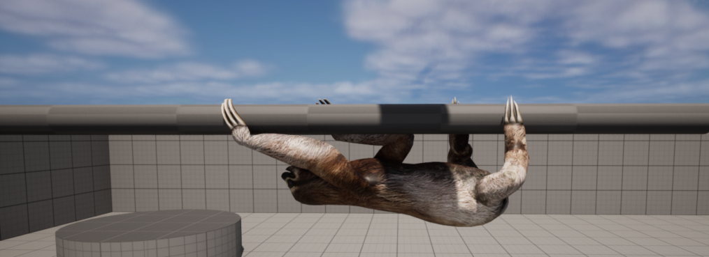

## Разработка алгоритма процедурной анимации для ленивца

Данная работа представляет собой алгоритм процедурной анимации, основанный на инверсной кинематике CCD и имплементированный в игровой движок Unreal Engine 5 и реализованный с помощью системы визуального программирования blueprints.

Разработка осуществлена в рамках выпускной квалификационной работы по магистерской программе "Технологии разработки компьютерных игр" [Школы разработки видеоигр Университета ИТМО](https://itmo.games/).
___

_Запуск и использование:_
1. Скачайте данный репозиторий
2. Убедитесь, что на компьютере установлен игровой движок Unreal Engine версии 5.3.2
3. Запустите файл проекта ProceduralSloth.uproject
4. Управляйте моделью с помощью клавиш и мыши

_Управление:_

D - движение по направлению головы ленивца  
A - движение назад  
W/S – смена ветки либо движение вокруг ствола влево\вправо  
R - немедленный разворот  
T - ручная смена очередности конечности модели  
Mouse/mouse wheel - управление камерой

_Особенности:_
* Возможно перемещение модели с помощью гизмо на тестовой сцене во вьюпорте для использования в различных сценариях
* Возможно изменение значений переменных для изменения поведения модели как в BP_Sloth1, так и в подключенных компонентах AC_Handler для каждой конечности
* Возможно установка уровня Debug режима через видимую переменную в details модели
* Возможно изменение скорости перемещения через переменную StepSpeed в BP_Sloth1

_Скриншот примера модели на сцене:_  

_Источник модели ленивца:_  
бесплатная (для некоммерческого использования) модель 3D ленивца [отсюда](https://www.cadnav.com/3d-models/model-54106.html)  

_Дополнительно:_  
Полный текст работы на [GitHub](https://github.com/TimArVR/ITMO_ProceduralSloth/blob/main/%D0%92%D0%9A%D0%A0_%D0%A1%D1%83%D0%BB%D1%82%D0%B0%D0%BD%D0%BE%D0%B2%D0%A2%D0%98_%D0%A8%D0%A0%D0%92.pdf)   

_Разработчик:_  
Султанов Т.И. группа J4221 